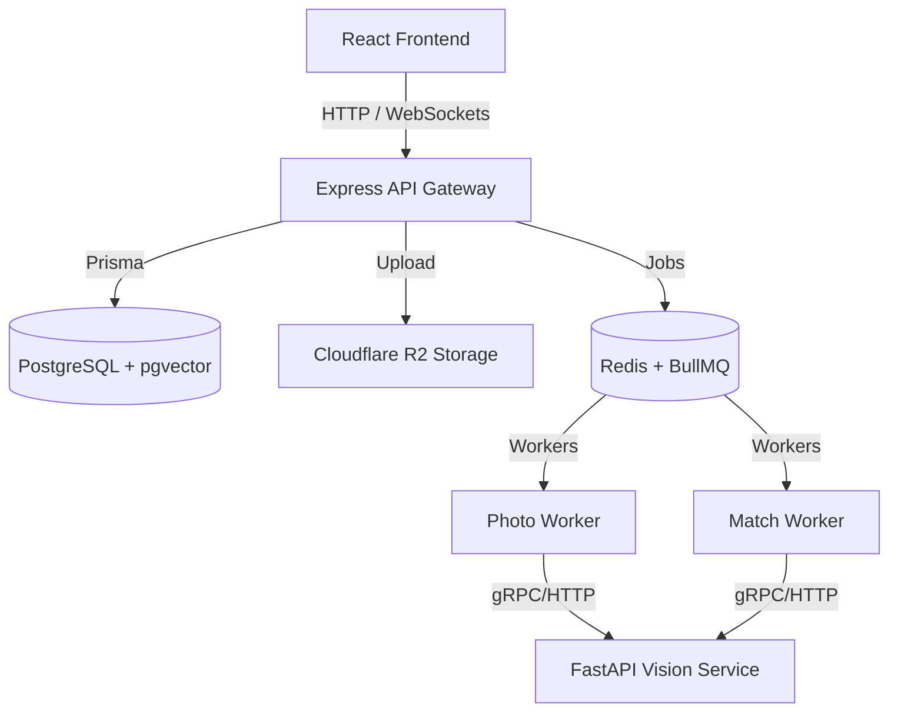

# 📸 Momnts

**Momnts** is a face recognition–based event photo management web application. It functions as an identity-based photo retrieval system scoped to specific events, ensuring event photo organization and private, personalized gallery deliveries.

---

## 🏗️ System Architecture

The application is built as a distributed multi-service system:



### 1. Frontend (`momnts-web`)
* **Framework:** React (Vite) with TypeScript.
* **Routing:** React Router v7.
* **State & Fetching:** TanStack Query (React Query) for server state caching.
* **Styling:** Tailwind CSS and `@base-ui/react` + `shadcn/ui`.
* **Animations:** Motion (formerly Framer Motion) and Tailwind transitions.
* **Realtime:** Socket.IO Client for instant upload and processing notifications.

### 2. Backend (`momnts-api`)
* **Runtime & Package Manager:** Bun / Node.js.
* **Framework:** Express with TypeScript.
* **Database Access:** Prisma ORM (v7) with PostgreSQL.
* **Authentication:** JWT-based access/refresh token model with Blacklisting.
* **File Uploads:** Multer for handling multipart/form-data.
* **Object Storage:** Cloudflare R2 (S3-compatible API).
* **Asynchronous Jobs:** BullMQ + Redis for background queues (`photo-processing` and `match-processing`).

### 3. AI Vision Service (`momnts-vision`)
* **Framework:** FastAPI (Python).
* **Face Detection & Embeddings:** DeepFace (handling face detection, bounding box extraction, and generating 512-dimension vector embeddings).
* **Vector Matcher:** FAISS / NumPy for nearest neighbor vector similarity search.

---

## 💾 Core Domain Model & Database Schema

The database uses PostgreSQL with the **pgvector** extension to store and query high-dimensional face embeddings. All queries are strictly scoped by `event_id` to enforce event isolation.

### Main Data Models

* **`User`**: Core user accounts. Stores profile info, uploaded selfie URL, and the generated 512-dimensional selfie embedding (`vector(512)`).
* **`Event`**: Created by organizers. Configured with metadata (name, location, date, attendee upload limits) and a unique `invite_code`.
* **`EventAccess` (CRITICAL)**: Implements membership-driven access control. Tracks the relationship between users and events, roles (`ORGANIZER` or `ATTENDEE`), and photo upload counters.
* **`Photo`**: Tracks event photos uploaded to Cloudflare R2. Stores CDN URLs, resolution dimensions, and processing status.
* **`FaceProfile`**: Represents unique identified faces detected in an event's photos. Contains the average embedding vector (`vector(512)`), event scoping, and links to the `User` who claims it.
* **`PhotoFace`**: Junction table mapping detected faces (`FaceProfile`) to specific photos, specifying boundary boxes (`bbox_x`, `bbox_y`, `bbox_w`, `bbox_h`) and model detection confidence.

---

## 🔁 Core Application Flows

### 1. Event Setup & Join
1. An organizer creates an Event. An entry is made in `Event` and an organizer-role entry is created in `EventAccess`.
2. Attendees input the event `invite_code` to gain membership (`EventAccess` role: `ATTENDEE`).

### 2. Photo Upload & Background Processing
1. A user uploads photos to `/api/photos/:eventId/upload`. 
2. The server uploads the images directly to Cloudflare R2, inserts pending records in the `Photo` table, and queues a `photo-processing` task in BullMQ.
3. The **Photo Worker** picks up the task, calls the FastAPI `/detect` endpoint with the photo's R2 URL, receives face bounding boxes + embeddings, saves new `FaceProfile` models or joins matching profiles in PostgreSQL, and flags the photo as `processed`.

### 3. Selfie Matching & Gallery Delivery
1. The user uploads an onboarding selfie (`/api/onboarding/selfie` or `/api/users/selfie`).
2. The server calls FastAPI `/embed` to generate a 512-dimensional vector embedding of the selfie and saves it to the `User` record.
3. The server queues a `match-processing` task in BullMQ. The **Match Worker** runs vector similarity searches (using cosine distance) against all unclaimed `FaceProfile` embeddings scoped under the user's active events.
4. When a match is confirmed, the user claims that `FaceProfile`.
5. The User Gallery retrieves all `Photo` entries associated with the user's claimed `FaceProfile` via the `PhotoFace` mapping.

---

## 📂 Project Directory Structure

```text
├── momnts-api/          # Express API server, Prisma models, Socket.IO handlers, and BullMQ workers
│   ├── prisma/          # Prisma schema definition and migrations
│   ├── src/
│   │   ├── config/      # Shared configuration and environments
│   │   ├── controllers/ # HTTP controller handlers
│   │   ├── lib/         # BullMQ queues, Multer client, R2 S3 client, and Socket.IO servers
│   │   ├── middleware/  # JWT Auth, request validation, and upload validation
│   │   ├── routes/      # Express API routers (auth, events, gallery, photos, onboarding, users)
│   │   ├── workers/     # BullMQ background workers (photo.worker.ts, match.worker.ts)
│   │   └── index.ts     # Entry point server configuration
├── momnts-vision/       # FastAPI computer vision endpoints for face processing
│   ├── routes/          # API routes for face /detect, /embed, and /match
│   ├── services/        # Wrapper services for DeepFace and vector matching
│   └── main.py          # FastAPI application initialization
└── momnts-web/          # React + Vite web frontend
    ├── src/
    │   ├── components/  # Shared layouts, buttons, dialogs, and shadcn primitives
    │   ├── features/    # Module-specific logic (auth, events, users)
    │   ├── hooks/       # Custom React hook utilities (sockets, state, etc.)
    │   ├── layouts/     # Shared route wrappers (DashboardLayout)
    │   └── pages/       # Route-level pages (landing page, auth pages, event view, gallery)
```

---

## 🛠️ Getting Started & Installation

### Prerequisites
* [Node.js](https://nodejs.org/) (v18+) or [Bun](https://bun.sh/) (v1.1+)
* [Python](https://www.python.org/) (v3.10+)
* [PostgreSQL](https://www.postgresql.org/) with the `pgvector` extension installed
* [Redis](https://redis.io/) server (local or hosted Upstash)
* Cloudflare R2 bucket

---

### Setup Instructions

#### 1. Setup Backend API & Workers (`momnts-api`)

Navigate to the directory and install dependencies:
```bash
cd momnts-api
bun install
```

Create a `.env` file in `momnts-api/` with the following variables:
```env
DATABASE_URL="postgresql://<username>:<password>@localhost:5432/momnts?schema=public"
JWT_SECRET="your_jwt_secret"
AUTH_REFRESH_SECRET="your_refresh_secret"
APP_PORT=3000

R2_ACCOUNT_ID="your_cloudflare_r2_account_id"
R2_ACCESS_KEY_ID="your_r2_access_key"
R2_SECRET_ACCESS_KEY="your_r2_secret_key"
R2_BUCKET_NAME="momnts-photos"
R2_PUBLIC_URL="https://your-bucket-public-url.r2.dev"
R2_ENDPOINT_URL="https://your_account_id.r2.cloudflarestorage.com"

REDIS_URL="redis://localhost:6379"
RESEND_API_KEY="your_resend_api_key"
```

Initialize your database schema and run migrations:
```bash
bun prisma migrate dev
```

Run both the API server and BullMQ workers concurrently:
```bash
bun run server
```
*Alternatively, you can run components individually using `bun run dev`, `bun run worker:photos`, or `bun run worker:matching`.*

---

#### 2. Setup Vision Microservice (`momnts-vision`)

Navigate to the directory and create a Python virtual environment:
```bash
cd momnts-vision
python -m venv .venv
source .venv/bin/activate
pip install -r requirements.txt
```

Create a `.env` file in `momnts-vision/`:
```env
PORT=8000
```

Start the FastAPI microservice:
```bash
uvicorn main:app --host 0.0.0.0 --port 8000 --reload
```

---

#### 3. Setup React Web Frontend (`momnts-web`)

Navigate to the directory and install dependencies:
```bash
cd momnts-web
npm install
```

Create a `.env` file in `momnts-web/`:
```env
VITE_API_URL="http://localhost:3000"
```

Start the Vite development server:
```bash
npm run dev
```

---

## 📡 API Reference Summary

### Auth Routes (`/api/auth`)
* `POST /register` - Register a new user account.
* `POST /login` - Log in and obtain JWT access + refresh tokens.
* `POST /refresh` - Refresh an expired access token.
* `POST /logout` (Auth Required) - Logout and blacklist current active tokens.
* `GET /me` (Auth Required) - Fetch current logged-in user profile details.

### Event Routes (`/api/events`)
* `POST /create` (Auth Required) - Initialize a new event.
* `GET /my-events` (Auth Required) - List events organized by the user.
* `GET /joined` (Auth Required) - List events joined by the user.
* `POST /join` (Auth Required) - Access an event using a unique invite code.
* `GET /:eventId` (Auth Required) - Retrieve details of an event.
* `PUT /:eventId` (Auth Required) - Update event details (Organizer only).
* `DELETE /:eventId` (Auth Required) - Terminate event (Organizer only).
* `GET /:eventId/attendees` (Auth Required) - List event participants.
* `PATCH /:eventId/regenerate-code` (Auth Required) - Reset invite code (Organizer only).
* `POST /:eventId/leave` (Auth Required) - Resign event access (Attendee only).

### Photos Routes (`/api/photos`)
* `POST /:eventId/upload` (Auth Required) - Upload multi-part photos (Max 10 per request).
* `GET /:eventId` (Auth Required) - Retrieve photos from the event.
* `GET /:eventId/:photoId` (Auth Required) - Retrieve specific photo details.
* `GET /:eventId/:photoId/download` (Auth Required) - Generate a signed download URL.
* `DELETE /:eventId/:photoId` (Auth Required) - Delete photo (Uploader or Organizer only).

### Gallery Routes (`/api/events/:eventId/photos`)
* `GET /all` (Auth Required) - Fetch all public event photos.
* `GET /mine` (Auth Required) - Fetch personal gallery of photos matching the user's face.
* `GET /uploads` (Auth Required) - Fetch photos uploaded to this event by the user.

### Onboarding & User Routes (`/api/onboarding`, `/api/users`)
* `POST /api/onboarding/selfie` (Auth Required) - Upload onboarding selfie and generate initial face embeddings.
* `PUT /api/users/selfie` (Auth Required) - Update or replace active profile selfie.
* `PUT /api/users/profile` (Auth Required) - Modify user account settings.
